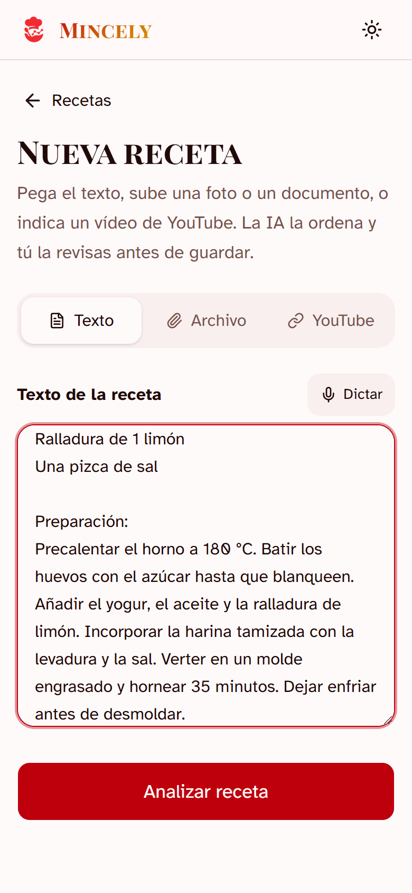
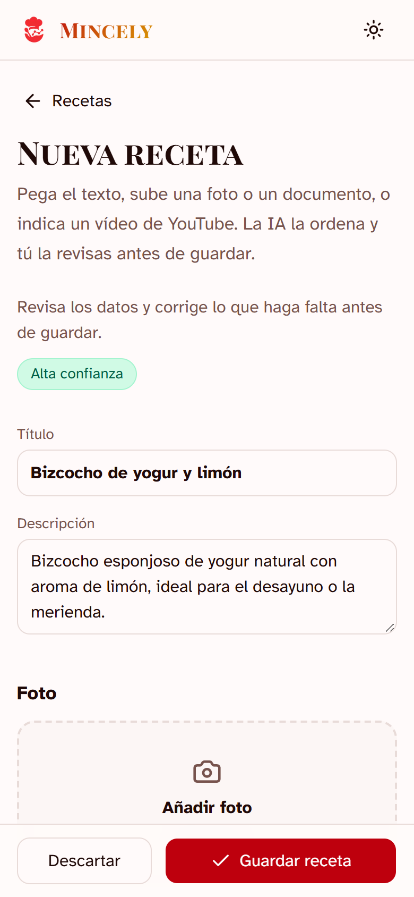
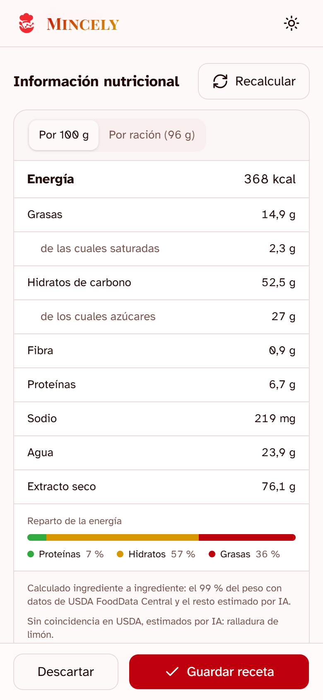
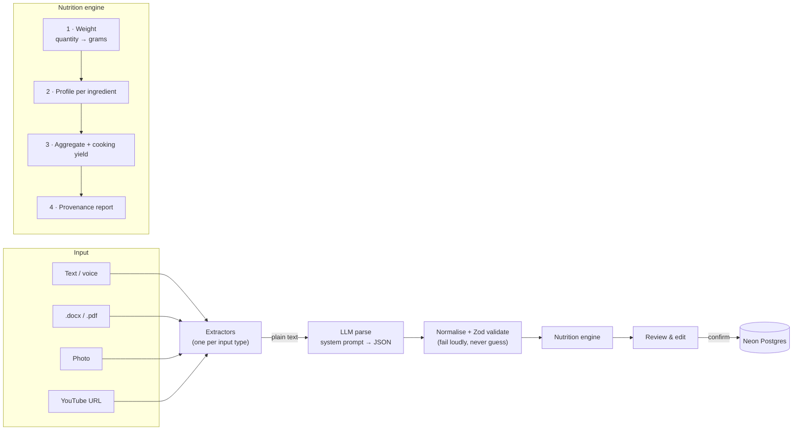

<div align="center">


# Mincely

**Recipe Intelligence Engine** — turns any recipe (pasted text, Word, PDF, a photo, a YouTube video) into clean structured data, with nutrition computed ingredient by ingredient from USDA lab data.

[](https://github.com/llanasnas/Mincelly/actions/workflows/ci.yml)
[](https://nextjs.org)
[](https://www.typescriptlang.org)
[](https://tailwindcss.com)
[](#testing)
[](LICENSE)

</div>

<p align="center">
  
  &nbsp;
  
  &nbsp;
  
</p>

---

## Why I built this

My father has always been passionate about cooking. He managed dozens of recipes, but they were scattered everywhere — handwritten notes, screenshots, WhatsApp messages, Word files, YouTube videos. What he really wanted was a single place to keep them in a clean, structured way, and to know the nutritional values of each one.

That conversation became Mincely. I built it to solve his problem, and to push myself on the parts that make an AI feature trustworthy in production: validating everything a model returns, knowing when *not* to trust it, and telling the user where every number comes from.

## What it does

- **Imports from anything** — pasted or dictated text, `.docx`, `.pdf`, photos (JPG/PNG/WebP) and YouTube videos (via the transcript). Word files that hold the recipe as an embedded photo are OCR'd too.
- **Structures it with an LLM** — title, servings, times, ingredients with quantity/unit/notes, ordered steps, category, difficulty, estimated cost. Anthropic Claude, OpenAI or a local Ollama model, selectable at runtime.
- **Computes nutrition from data, not vibes** — per 100 g and per serving, calculated from each ingredient's weight and its USDA FoodData Central profile. The UI states how much of the dish is backed by lab data and lists every ingredient's contribution.
- **Human in the loop** — nothing is saved until you have reviewed and edited the result. Nutrition recalculates on demand after edits.
- **Made for the kitchen** — phone-first UI, scale a recipe to any number of servings, tick ingredients off as you go, export a PDF, dark mode.
- **Works without AI** — no API key? A heuristic parser handles sectioned text, and nutrition still comes from the databases.
- **Private by choice** — optional Google sign-in with an email allowlist.

## How it works



`POST /api/process` returns a recipe **without persisting it**; the user reviews it and `POST /api/recipes` saves the confirmed version. If extraction or validation fails, the API returns a typed error code — there is no silent fallback to made-up data.

## The nutrition engine

The first version asked the model for the nutrition of the whole dish. It was fast, plausible and frequently wrong — one of my father's cakes came back with 5 g of sugar per 100 g when a fifth of its weight is sugar. The current engine ([`lib/nutrition/engine.ts`](lib/nutrition/engine.ts)) computes the numbers bottom-up instead:

1. **Weight.** Every quantity becomes grams. Mass units convert exactly; volumes use a per-ingredient density table (a cup of flour is not a cup of honey); counted items ("2 eggs", "1 onion") use the model's contextual estimate, with a lookup table as a fallback. A real unit conversion always beats an estimate.
2. **Profile.** Each ingredient is resolved to per-100 g nutrients, most trustworthy source first:
   | Tier | Source | Notes |
   |---|---|---|
   | 1 | **Bundled USDA snapshot** — 168 pantry staples | Instant, deterministic, offline. Generated from pinned `fdcId`s by [`scripts/build-reference-foods.mjs`](scripts/build-reference-foods.mjs). Exact-match only. |
   | 2 | **Live USDA FoodData Central search** | Foundation + SR Legacy first, survey data as a fallback. Custom candidate ranking (below). |
   | 3 | **LLM estimate for that single ingredient** | One batched call for whatever is left. Sanity-checked against the Atwater energy formula. |
3. **Aggregate.** Nutrients are summed by weight and corrected for **cooking yield**: a sponge loses water in the oven, pasta absorbs water that is not in the ingredient list. Only water changes — nutrients stay put — so dry extract is consistent by construction.
4. **Report.** The result carries its provenance: source, the share of the dish's weight backed by USDA data, per-ingredient contributions and plain-language notes about any gaps. A nutrient is omitted rather than understated when too much of the dish has no value for it.

Things that turned out to matter:

- **USDA's relevance ranking is not an ingredient matcher.** Searching "egg" returns *egg white* and *egg bagels* before the whole raw egg. Taking the first hit produced confidently wrong data, so candidates are re-ranked: every meaningful query word must be present, the plain raw form wins over processed variants, accompaniments after "with…" don't count, branded items are penalised. When nothing fits, the engine returns *no match* — "cocoa butter" must not become butter — and the LLM tier estimates the real food.
- **Units arrive as people write them.** "2 cucharadas", "200 gramos", "1½ tazas", "2-3 dientes". A unit that fails to convert must never silently drop an ingredient's weight.
- **A missing ingredient must not dilute the rest.** Ingredients without data are excluded from both the totals and the weight, and reported — not counted as 0 kcal.
- **The model's own whole-dish guess is still useful** as a cross-check: a large gap between it and the computed value usually means a quantity was misread, and is flagged for review.

## Engineering notes

- **LLM output is untrusted input.** Responses are extracted from fences or prose, unwrapped, normalised (small local models are creative with structure) and validated with Zod before anything else touches them. Optional hints the model gets wrong are dropped individually instead of failing the recipe.
- **Provider abstraction** ([`lib/llm`](lib/llm)) with one interface for Anthropic, OpenAI and Ollama; the system prompt lives in [`prompts/parse-recipe.md`](prompts/parse-recipe.md), not in code.
- **Typed errors end to end.** `RecipeProcessingError` separates a user-facing message from technical detail, which is logged server-side and never sent to the client in production.
- **Database.** Plain SQL on Neon's serverless driver, no ORM. Saving a recipe — the JSON document plus its category and ingredient links — is a single atomic statement built from data-modifying CTEs, one round trip instead of dozens.
- **Security.** Google OAuth with a signed, HttpOnly session cookie and an email allowlist; open-redirect-safe return paths; per-client rate limiting on the endpoints that cost money; input size caps; uploaded images identified by magic bytes rather than the declared MIME type; standard security headers.
- **Mobile.** Photos are downscaled in the browser before upload — phone cameras produce files larger than serverless request limits, which was the real cause of "upload failed" on mobile. Touch-sized targets, safe-area insets, no iOS focus zoom, and a sticky save bar on the long review form.
- **Accessibility.** Semantic landmarks and headings, labelled controls, keyboard-operable tabs and combobox, visible focus, `prefers-reduced-motion`.

## Tech stack

| Layer | Technology |
|---|---|
| Framework | Next.js 16 (App Router, Turbopack), React 19 |
| Language | TypeScript (strict) |
| Styling | Tailwind CSS 4, shadcn/ui |
| Validation | Zod 4 |
| Database | Neon Postgres — `@neondatabase/serverless`, raw SQL |
| LLM | Anthropic Claude · OpenAI · Ollama |
| Nutrition | USDA FoodData Central |
| Documents | Mammoth (`.docx`), unpdf (`.pdf`), `@react-pdf/renderer` (export) |
| Images | Cloudinary |
| Testing | Vitest, PGlite (in-process Postgres) |
| Hosting | Vercel |

## Getting started

**Prerequisites:** Node.js 20+, [pnpm](https://pnpm.io), a [Neon](https://neon.tech) Postgres database (the free tier is enough).

```bash
git clone https://github.com/llanasnas/Mincelly.git
cd Mincelly
pnpm install

cp .env.example .env.local   # then fill it in
pnpm db:migrate              # creates tables and seeds categories
pnpm dev                     # http://localhost:3000
```

### Configuration

Everything is configured through `.env.local`; [`.env.example`](.env.example) documents every variable.

| Variable | Required | Purpose |
|---|---|---|
| `DATABASE_URL` | yes | Neon connection string |
| `LLM_PROVIDER` | no | `anthropic` (default), `openai`, `ollama` or `none` |
| `ANTHROPIC_API_KEY` / `OPENAI_API_KEY` | per provider | LLM credentials |
| `ENABLED_PROVIDERS` | no | Comma-separated list → shows a provider picker in the UI |
| `USDA_API_KEY` | recommended | Live USDA lookups ([free key](https://fdc.nal.usda.gov/api-key-signup)) |
| `CLOUDINARY_*` | no | Recipe photo uploads |
| `FORCE_LOGIN`, `GOOGLE_CLIENT_*`, `AUTH_SECRET`, `ALLOWED_EMAILS` | no | Google sign-in gate |

**No API key?** Set `LLM_PROVIDER=none`. Text with "Ingredientes" / "Preparación" (or "Ingredients" / "Instructions") headers is parsed heuristically, and nutrition is still computed from the bundled USDA data.

**Fully local AI:** [install Ollama](https://ollama.com), `ollama pull qwen2.5:7b` (and `llama3.2-vision:11b` for photos), then set `LLM_PROVIDER=ollama`.

### Scripts

| Command | |
|---|---|
| `pnpm dev` / `pnpm build` / `pnpm start` | Develop, build, serve |
| `pnpm typecheck` · `pnpm lint` · `pnpm test` | The checks CI runs |
| `pnpm test:coverage` | Tests with coverage |
| `pnpm db:migrate` | Apply pending SQL migrations |
| `pnpm nutrition:build-reference` | Regenerate the bundled USDA snapshot |

## Testing

```bash
pnpm test
```

421 tests, no network and no external services:

- **Unit** — quantity and unit parsing, the USDA candidate ranking (against recorded real API responses), the nutrition engine's aggregation and yield maths, LLM output normalisation, schema validation, auth tokens, rate limiting, extractors.
- **Integration** — `lib/db.ts` runs against a real Postgres compiled to WASM ([PGlite](https://pglite.dev)) with the project's own migrations applied, so the SQL is actually executed.
- **Consistency** — the category catalogue lives in code, SQL seeds and the LLM prompt; a test fails if the three drift apart.

CI runs typecheck, lint, tests and a production build on every push and pull request.

## Project structure

```
app/                     Next.js App Router
  (home)/                Recipe list — search and filters
  recipes/               New / detail / edit
  api/
    process/             Extract + parse + nutrition (does not persist)
    nutrition/           Recompute nutrition for an edited recipe
    recipes/             CRUD
    auth/                Google OAuth
components/              React components
lib/
  extractors/            One per input type: text, docx, pdf, image, youtube
  llm/                   Provider abstraction: Anthropic, OpenAI, Ollama
  nutrition/             Engine, USDA client + ranking, reference data, unit conversion
  parsers/               Heuristic parser for the no-AI mode
  auth/                  Session signing, allowlist, guards
  schema.ts              Zod schemas — the data model's source of truth
  process-recipe.ts      Orchestrator
  db.ts                  SQL
prompts/parse-recipe.md  System prompt
migrations/              SQL migrations
tests/                   unit/ and integration/
```

## Deployment

Deploys to [Vercel](https://vercel.com) as-is: import the repository, add the environment variables, run `pnpm db:migrate` against the production database once.

Processing a photo involves a vision call, a parsing call and nutrition lookups, so `/api/process` declares `maxDuration = 60`.

## Roadmap

- [ ] Evals with a labelled recipe dataset, to measure prompt and model changes instead of eyeballing them
- [ ] LLM observability (Langfuse)
- [ ] Semantic search over recipes (pgvector)
- [ ] Import from TikTok / Instagram
- [ ] Additional food composition sources (BEDCA, Open Food Facts) for products USDA doesn't cover

## License

[MIT](LICENSE)
